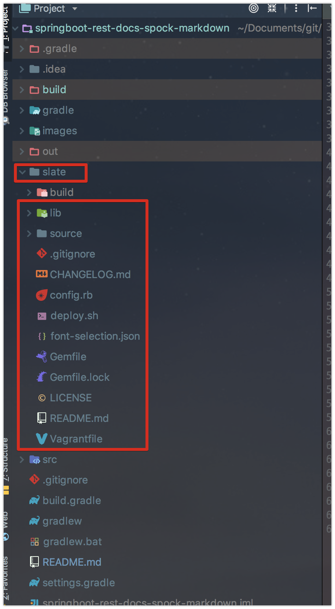
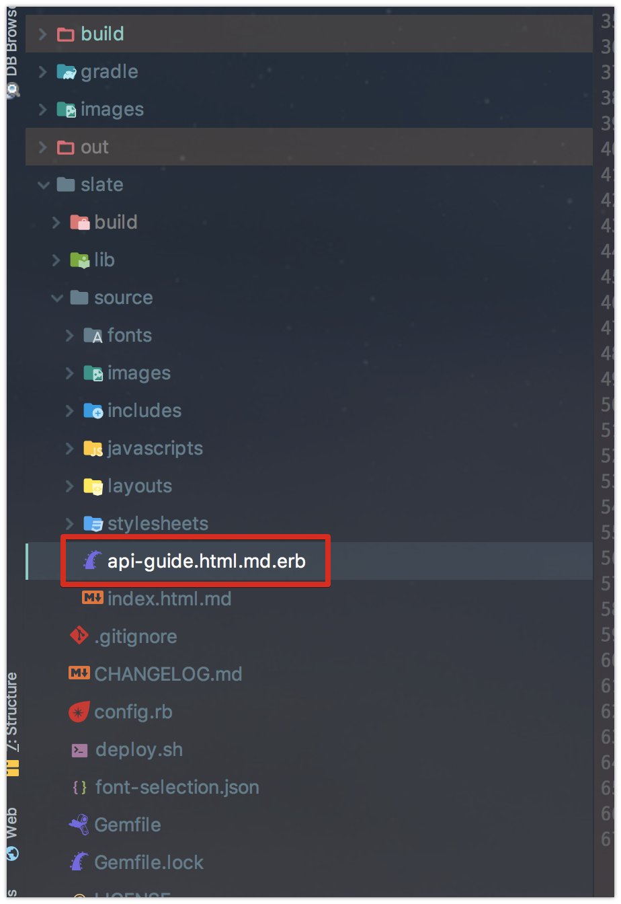

# Spring Rest Docs & Spock & Rest Assured & Markdown 적용하기

이번에 새로 시작하는 프로젝트에 [Spring Rest Docs](https://docs.spring.io/spring-restdocs/docs/current/reference/html5/)를 적용해보기로 했습니다.  
Spring Rest Docs를 처음 들어보시는 분들을 위해 간단하게 소개하자면, **테스트 코드를 기반으로 문서를 자동으로 생성**해주는 프로젝트입니다.  
팀의 API 문서 자동화를 위해 선택하게 되었는데요, Swagger가 가지고 있는 단점들을 충분히 커버해줄만하다는 생각에 선택하게 되었습니다.  
  
Spring Boot Rest Docs의 기본 조합인 Mock MVC & Asciidoc 을 사용하지 않고, **Spock & Rest Assured & Markdown**을 써야겠다고 생각했는데요.  

* 이미 Groovy & Spock 기반으로 동적 언어로 테스트 코드 작성이 익숙한 상태
  * 문서화를 위해 테스트 프레임워크를 변경하는건 배보다 배꼽이 크다는 생각
* Mock MVC보다는 Rest Assured가 API 테스트 코드에 좀 더 직관적이라고 생각
* 팀 내 **위키를 비롯한 많은 문서들이 Markdown 기반**으로 진행
  * Asciidoc을 별도로 팀 전원이 익히는건 낭비라고 생각

> 이번 포스팅은 Spring Rest Docs를 Markdown으로 관리하기이지만, 끝까지 읽어보시면 **귀찮더라도 Asciidoc을 배워서 쓰자**란 결론이 나오실 것 같습니다.  
Spock, Rest Assured는 괜찮습니다. 같이 쓰셔도 좋습니다.  
Markdown을 함께 쓰기가 너무 불편합니다.  
저는 그냥 Asciidoc을 써야겠다고 생각했습니다. ㅠㅠ  
혹시나 Markdown을 써야하는 분들이 계실까봐 정리해놓습니다.

모든 코드는 [Github](https://github.com/jojoldu/springboot-rest-docs-spock-markdown)에 있으니 참고하시면 좋을것 같습니다.  
  
프로젝트 환경은 스프링부트 2.0.1, Gradle 기반입니다.

## 1. 프로젝트 생성

프로젝트를 생성하시고 build.gradle을 다음과 같이 작성합니다.  
먼저 Rest Assured를 위한 의존성들을 추가합니다.

```groovy
...
dependencies {
    ...
    testCompile('io.rest-assured:rest-assured:3.0.2') // for rest assured
    testCompile('org.springframework.restdocs:spring-restdocs-restassured') // for rest assured
    ...
}
```

spock을 위한 의존성과 플러그인을 설치합니다.

```groovy
...
apply plugin: 'groovy' // for spock
...
dependencies {
    ...
    testCompile('org.spockframework:spock-core:1.1-groovy-2.4') // for spock
    testCompile('org.spockframework:spock-spring:1.1-groovy-2.4') //for spock
}

```

마지막으로 Markdown으로 Rest Docs를 작성할 수 있게 Gradle Task를 추가합니다.


```groovy
...
ext {
    snippetsDir = file('build/generated-snippets') // rest docs로 markdown 파일들이 생성되는 위치
}

test {
    outputs.dir snippetsDir
}

// bundleInstall Task
task(bundleInstall, type: Exec) {
    workingDir file('slate') // slate 디렉토리에서
    executable 'bundle' // bundle 이란 명령어를 수행한다.
    args 'install' // bundle 명령어의 인자값으로 install 추가
}

// slate Task
task(slate, type: Exec) {
    dependsOn 'bundleInstall', 'test'
    workingDir file('slate')
    executable 'bundle'
    args 'exec', 'middleman', 'build', '--verbose' // debug mode
}

build {
    dependsOn 'slate'
}
...
```

* ```bundleInstall``` Task
  * slate 디렉토리에서 ```bundle install```를 수행하는것과 동일합니다.
* ```slate``` Task
  * slate 디렉토리에서 ```bundle exec middleman build --verbose```를 수행하는것과 동일합니다.
  * ```--verbose```는 디버그 모드로 수행하겠다는 의미입니다.

위 Task들의 순서는 ```dependsOn```에 따라 ```test``` -> ```bundleInstall``` -> ```slate``` -> ```build```가 됩니다.  
  
이렇게 하시면 build.gradle의 전체 코드는 아래와 같습니다.

```groovy
buildscript {
    ext {
        springBootVersion = '2.0.1.RELEASE'
    }
    repositories {
        mavenCentral()
    }
    dependencies {
        classpath("org.springframework.boot:spring-boot-gradle-plugin:${springBootVersion}")
    }
}

apply plugin: 'groovy' // for spock
apply plugin: 'java'
apply plugin: 'eclipse'
apply plugin: 'org.springframework.boot'
apply plugin: 'io.spring.dependency-management'

group = 'com.jojoldu'
version = '0.0.1-SNAPSHOT'
sourceCompatibility = 1.8
targetCompatibility = 1.8

repositories {
    mavenCentral()
}

ext {
    snippetsDir = file('build/generated-snippets')
}

test {
    outputs.dir snippetsDir // 자동 생성되는 마크다운 파일들이 저장될 장소
}

task(bundleInstall, type: Exec) {
    workingDir file('slate')
    executable 'bundle'
    args 'install'
}

task(slate, type: Exec) {
    dependsOn 'bundleInstall', 'test'
    workingDir file('slate')
    executable 'bundle'
    args 'exec', 'middleman', 'build', '--verbose' // debug mode
}

build {
    dependsOn 'slate'
}

dependencies {
    compile('org.springframework.boot:spring-boot-starter-data-jpa')
    compile('org.springframework.boot:spring-boot-starter-web')

    runtime('com.h2database:h2')

    compileOnly('org.projectlombok:lombok')

    testCompile('io.rest-assured:rest-assured:3.0.2') // for rest assured
    testCompile('org.springframework.restdocs:spring-restdocs-restassured') // for rest assured
    testCompile('org.springframework.boot:spring-boot-starter-test')
    testCompile('org.spockframework:spock-core:1.1-groovy-2.4') // for spock
    testCompile('org.spockframework:spock-spring:1.1-groovy-2.4') //for spock
}

```

자 이렇게 하면 프로젝트의 기본 의존성들은 다 추가되었습니다!  

## 2. slate 추가

Markdown으로 Rest Docs를 작성하려면 Ruby 프로젝트인 [slate](https://github.com/lord/slate)가 필요합니다.  


(slate로 만든 대표적인 API: [Travis CI API](https://docs.travis-ci.com/api/?http#external-apis))  
  

Gradle로 관리되는 프로젝트가 아니기 때문에 **프로젝트를 직접 Download**받아서 진행해야만 합니다.  
아래 쉘 명령어를 차례로 입력합니다.

```bash
# 현재 프로젝트로 이동
cd 현재 프로젝트 디렉토리

# slate download
wget https://github.com/lord/slate/archive/master.zip

# 압축 해제
unzip master.zip

# 해제된 디렉토리명 수정
mv ./slate-master ./slate

# zip 파일 제거
rm ./master.zip
```

요렇게 다 받으셨으면 프로젝트에 다음과 같이 slate 디렉토리에 파일들이 있어야 합니다.



자 그럼 slate가 사용할 Ruby 라이브러리들을 받아야 하는데요.  
이를 위해 Ruby 라이브러리 관리를 진행해줄 [bundler](http://bundler.io/)을 설치하겠습니다.  
  
Ruby가 설치되어 있으시다면 아래 명령어를 바로 입력합니다.

```bash
gem install bundler
```

> 참고: Mac에 기본 설치된 Ruby를 이용하시면 **Permission Denied** 문제가 발생할 수 있습니다.  
그럴 경우 [이전 포스팅](http://jojoldu.tistory.com/288)를 참고해 문제를 해결하시고 계속 진행해주세요.

bundler도 설치가 완료 되셨으면 개발환경 구축은 끝입니다!  
바로 문서를 만들어보겠습니다.

## 3. Markdown 및 테스트 코드 작성

### 3-1. 메인 Markdown 작성

Rest Docs가 테스트 코드를 기반으로 문서를 만들어 준다해도, **전체적인 구조와 내용을 잡아주는 index용 Markdown 파일**이 필요합니다.  
slate/source/ 아래에 있는 ```index.html.md``` 파일을 복사하여, 같은 위치에 ```api-guide.html.md.erb``` 파일을 생성합니다.



erb라는 확장자가 생소하실텐데요.  
[Ruby의 템플릿엔진](https://www.joinc.co.kr/w/Site/Ruby/ERB)입니다.  
(일종의 JSP, Freemarker, Handlebars와 같다고 보시면 됩니다.)  
  
> 이 확장자를 써야하는 이유는 간단합니다.  
**Markdown은 import 기능이 없기 때문**입니다.  
Asciidoc의 경우 import가 지원되지만, Markdown은 그런 기능이 없기 때문에 Ruby의 템플릿엔진을 통해 **다른 Markdown 파일을 import**시키는 것입니다.  
  
방금 생성한 ```api-guide.html.md.erb```에 간단한 내용을 추가합니다.

```markdown
---
title: REST Notes API Guide

language_tabs:
  - http

search: true
---

# Overview


## HTTP Method

Restful API


Method     | Usage
-------- | -----
`GET`    | 조회
`POST`   | 등록
`PUT`    | 수정
`DELETE` | 삭제
```

여기까지만 작성하고 저장한 뒤, 터미널을 열어 ```./gradlew build```를 수행합니다.  


### 3-2. 테스트 코드 작성

## 4. Build 및 문서 확인

## 5. 결론?

저는 일단 **Markdown으로 Rest Docs 작성하는걸 포기**했습니다.  
몇가지 큰 이유가 있었는데요.

* slate에 의존해야만 하는 구조
  * 팀 구성원 전체가 Ruby & Gem을 설치하고 ```bundler```까지 설치해야하는게 너무 번잡합니다.
* 만들어지는 문서가 기존 스프링 관련 문서들에 비해 UI가 친숙하지 않습니다.
* 빌드시간이 너무 오래 걸립니다.
  * Ruby 의존성들이 많아 빌드시간이 전체적으로 너무 오래걸립니다.

다음 시간엔 기본 버전인 Asciidoc으로 진행하는 방법을 소개드리겠습니다.  
훨씬 더 간편하게 문서가 자동화 됩니다.  
Asciidoc은 실제 프로젝트에 적용되는걸 기준으로 소개드리겠습니다.  
  
긴 글 끝까지 읽어주셔서 감사합니다 :)

## 참고 

* [spring-restdocs docs](https://docs.spring.io/spring-restdocs/docs/current/reference/html5/)
* [sample-rest-notes-slate](https://github.com/spring-projects/spring-restdocs/tree/v2.0.1.RELEASE/samples/rest-notes-slate)
* [sample-rest-assured](https://github.com/spring-projects/spring-restdocs/blob/v2.0.1.RELEASE/samples/rest-assured)